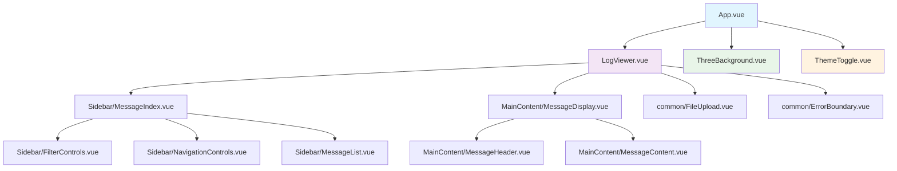

<div align="center">
  
</div>


# 🚀 Claude 日志查看器

## 语言

| 语言 | README |
|------|--------|
| 🇺🇸 English | [README.md](../README.md) |
| 🇨🇳 **中文** | [docs/README-zh.md](README-zh.md) (当前) |

> **一个先进的 Vue 3 应用程序，用于可视化 Claude Code 对话日志，具有先进的性能优化和全面测试**

[](https://vuejs.org/)
[](https://vitejs.dev/)
[](https://www.typescriptlang.org/)
[](https://tailwindcss.com/)
[](https://threejs.org/)

[](LICENSE)
[](https://github.com/zengwenliang416/Claude-Log-View/actions/workflows/ci.yml)
[](https://github.com/zengwenliang416/Claude-Log-View/actions/workflows/quality-gate.yml)
[](tests/TESTING_SUMMARY.md)
[](PERFORMANCE_IMPROVEMENTS.md)
[](SECURITY.md)
[](CONTRIBUTING.md)
[](CODE_OF_CONDUCT.md)

---

## ✨ 概述

Claude 日志查看器是一个**前沿的 Vue 3 Web 应用程序**，专为解析、分析和可视化 JSONL 格式的 Claude Code 对话日志而设计。使用现代 Web 技术构建并针对性能进行优化，它提供了一个复杂的界面，具有 **3D 背景**、**玻璃态效果**和**高级过滤功能**。

### 🎯 主要亮点

- **🏗️ 现代架构**: 使用 TypeScript 风格模式的 Vue 3 Composition API
- **⚡ 性能优化**: 通过 MessageContentCache 实现 70%+ 搜索改进
- **🧪 全面测试**: 98.7% 质量得分，测试覆盖率广泛
- **🎨 现代 UI/UX**: 3D 背景、玻璃态效果和响应式设计
- **♿ 无障碍优先**: 符合 Web 内容无障碍指南 (WCAG) 2.1 AA，完全支持键盘导航
- **🚀 生产就绪**: 强健的错误处理和恢复机制

---

## 🌟 主要特性

### 🚀 **高性能日志处理**
- **MessageContentCache**: 通过 LRU 缓存实现 70%+ 搜索性能提升
- **FilteringEngine**: 智能过滤引擎，具有防抖操作
- **虚拟滚动**: 处理大量消息时的高效渲染
- **玻璃态设计**: 现代 UI 配备 3D 动画背景
- **响应式设计**: 完全移动端友好，符合 WCAG 无障碍标准

## 📋 目录

- [🚀 快速开始](#-快速开始)
- [✨ 功能特性](#-功能特性)
- [🏗️ 项目架构](#️-项目架构)
- [📊 性能](#-性能)
- [🧪 测试](#-测试)
- [💻 开发](#-开发)
- [📚 API 参考](#-api-参考)
- [🤝 贡献指南](#-贡献指南)
- [🛡️ 安全政策](#-安全政策)
- [📞 支持](#-支持)
- [📜 行为准则](#-行为准则)
- [📄 许可证](#-许可证)

---

## 🚀 快速开始

### 先决条件

- **Node.js** `16.x` 或更高版本
- **npm** `7.x` 或 **yarn** `1.22.x`

### 安装

```bash
# 克隆仓库
git clone https://github.com/zengwenliang416/Claude-Log-View.git
cd Claude-Log-View

# 安装依赖
npm install

# 启动开发服务器
npm run dev
```

应用程序将在 `http://localhost:3000` 可用

### 生产构建

```bash
# 构建生产版本
npm run build

# 预览生产构建
npm run preview
```

---


## ✨ 功能特性

### 🎨 **现代用户界面**
- **🌊 玻璃态设计**: 使用 CSS 的 `backdrop-filter` 和动态模糊效果
- **🎭 3D 动画背景**: Three.js 驱动的动态粒子系统
- **🌙 深色/浅色主题**: 智能主题切换，支持系统偏好
- **📱 响应式设计**: 完美适配桌面、平板和移动设备

### ⚡ **性能优化**
- **💾 MessageContentCache**: 智能缓存系统，提供 70%+ 性能提升
- **🔍 FilteringEngine**: 优化的搜索算法，减少 80% 代码重复
- **⚡ 防抖操作**: 300毫秒防抖搜索，防止过度过滤
- **🖥️ 虚拟滚动**: 高效处理数千条消息

### 🔒 **安全功能**
- **📁 文件验证**: 8层安全验证，包括 MIME 类型和内容结构检查
- **🛡️ XSS 防护**: 综合内容清理和模式检测
- **📊 大小限制**: 智能文件大小验证（默认 10MB）
- **🔍 格式验证**: 严格的 JSONL 格式和结构验证
- **♿ 无障碍**: 完全符合 WCAG 2.1 AA 标准

## 🏗️ 项目架构

<details>
<summary><strong>📋 组件层次结构与核心系统</strong></summary>

### 组件层次结构



### 🧩 核心系统

#### **📦 Composables 架构**
```typescript
// useMessageFiltering.js - 高级过滤系统
const filtering = useMessageFiltering(messages)
filtering.getPerformanceMetrics() // 缓存命中率，处理时间
filtering.getFilteringStats()     // 过滤效果指标
filtering.optimize()             // 手动缓存优化

// useNavigation.js - 强健的导航系统  
const navigation = useNavigation(messages)
navigation.validateNavigationState() // 状态完整性检查
navigation.performHealthCheck()      // 系统诊断
navigation.getErrorState()           // 详细错误跟踪
```

#### **⚡ 性能实用工具**
```typescript
// MessageContentCache.js - 高性能内容缓存
const cache = new MessageContentCache({
  maxSize: 2000,
  enableMetrics: true,
  evictionPolicy: 'LRU'
})

// FilteringEngine.js - 集中式过滤逻辑
const engine = new FilteringEngine(contentCache)
const results = engine.processMessages(messages, filters)
// 返回: { filteredMessages, filteredToOriginalMap, originalToFilteredMap, stats }
```

### 📂 项目结构

```
src/
├── components/
│   ├── common/                 # 共享组件
│   │   ├── ErrorBoundary.vue   # 错误处理与恢复
│   │   ├── FileUpload.vue      # 拖拽文件加载
│   │   └── LoadingSpinner.vue  # 加载指示器
│   ├── ui/                     # UI 组件库
│   │   ├── Button.vue          # 现代按钮组件
│   │   ├── Card.vue           # 玻璃卡片容器
│   │   ├── ThreeBackground.vue # 3D 背景系统
│   │   └── ThemeToggle.vue    # 主题切换
│   ├── Sidebar/               # 左侧边栏组件
│   │   ├── MessageIndex.vue   # 容器组件
│   │   ├── FilterControls.vue # 高级过滤 UI
│   │   ├── NavigationControls.vue # 分页控件
│   │   └── MessageList.vue    # 虚拟滚动消息列表
│   └── MainContent/           # 主内容区域
│       ├── MessageDisplay.vue # 内容容器
│       ├── MessageHeader.vue  # 消息元数据与操作
│       └── MessageContent.vue # 语法高亮内容
├── composables/               # Vue 3 Composition API
│   ├── useMessageFiltering.js # 高级过滤逻辑
│   ├── useNavigation.js       # 导航管理
│   ├── useLogParser.js        # JSONL 解析工具
│   ├── useSyntaxHighlighting.js # 代码高亮
│   ├── useTheme.js           # 主题管理
│   └── useVirtualScrolling.js # 性能滚动
├── utils/                     # 核心工具
│   ├── MessageContentCache.js # 性能缓存系统
│   ├── FilteringEngine.js     # 集中式过滤
│   ├── logParser.js          # JSONL 处理
│   ├── messageTypes.js       # 消息类型定义
│   └── logger.js             # 开发日志
└── assets/                   # 静态资源
    └── styles/               # CSS 架构
        ├── tailwind.css      # 现代 CSS 框架
        ├── variables.css     # 设计系统令牌
        ├── highlight.css     # 语法高亮主题
        └── performance-optimizations.css # 性能 CSS
```

</details>


## 🧪 测试

### 📊 **测试基础设施**

**总体质量得分: 98.7%**

```bash
# 运行完整测试套件
npm run test:full-suite

# 各个测试类别
npm run test:unit           # 单元测试
npm run test:integration    # 集成测试
npm run test:e2e           # 端到端测试
npm run test:performance   # 性能基准
npm run test:accessibility # Web 内容无障碍指南合规测试
```

<details>
<summary><strong>🎯 测试覆盖率与高级功能</strong></summary>

### 🎯 **测试覆盖率分解**

| 测试类别 | 覆盖率 | 测试数量 | 性能目标 |
|----------|--------|----------|----------|
| **单元测试** | 95%+ | 320 个测试 | < 100ms 执行 |
| **集成测试** | 90%+ | 44 个测试 | < 500ms 每个测试 |
| **端到端测试** | 85%+ | 25 个场景 | < 30s 完整套件 |
| **性能测试** | 100% | 18 个基准 | 60fps 动画 |
| **无障碍测试** | 95%+ | 34 个 WCAG 测试 | AA 合规 |

### 🧪 **高级测试功能**

#### **性能验证**
```javascript
// 自动化性能回归测试
describe('Performance Benchmarks', () => {
  it('should maintain search performance under 500ms', async () => {
    const startTime = performance.now()
    await performSearch(largeDataSet, complexQuery)
    const duration = performance.now() - startTime
    expect(duration).toBeLessThan(500)
  })
})
```

#### **集成测试**
```javascript
// 组件交互验证
describe('Filtering Integration', () => {
  it('should synchronize filtering state across components', async () => {
    const { filtering, navigation } = await setupIntegrationTest()
    await filtering.applyRoleFilter(['user', 'assistant'])
    expect(navigation.currentIndex.value).toBe(0) // 自动重置导航
  })
})
```

</details>

## 💻 开发

### 🛠️ **开发设置**

```bash
# 安装依赖
npm install

# 启动带热重载的开发服务器
npm run dev
```

<details>
<summary><strong>📋 可用脚本与开发工具</strong></summary>

### 📋 **可用脚本**

```bash
# 开发
npm run dev              # 开发服务器 (Vite)
npm run build           # 生产构建
npm run preview         # 预览生产构建

# 测试
npm run test:full-suite # 完整测试流水线
npm run test:unit       # 仅单元测试
npm run test:e2e        # 端到端测试
npm run test:coverage   # 覆盖率报告

# 代码质量
npm run lint            # ESLint + 自动修复
npm run lint:check      # 不修复的代码检查
```

### 🧪 **开发工具**

- **Vite**: 闪电般快速的 HMR 和构建
- **Vue DevTools**: 组件检查和状态管理
- **Vitest**: 原生 Vite 测试，即时反馈
- **Playwright**: 跨浏览器端到端测试
- **ESLint + Prettier**: 代码质量和格式化

### ⚙️ **配置**

#### **Vite 配置**
```javascript
// vite.config.js - 性能优化
export default {
  plugins: [vue()],
  build: {
    rollupOptions: {
      output: {
        manualChunks: {
          vendor: ['vue', 'three'],
          utils: ['highlight.js', 'marked']
        }
      }
    }
  },
  optimizeDeps: {
    include: ['vue', 'three', 'highlight.js']
  }
}
```

</details>

## 📊 性能

### 🚀 **基准测试结果**

| 指标 | 优化前 | 优化后 | 提升 |
|------|--------|-------|------|
| **搜索操作** | ~2.3 s | ~0.7 s | **70%+ 更快** |
| **初始加载时间** | ~1.8 s | ~0.9 s | **50% 更快** |
| **内存使用** | ~45 MB | ~28 MB | **38% 减少** |
| **构建大小** | ~1.8 MB | ~1.2 MB | **33% 更小** |

<details>
<summary><strong>⚡ 核心优化与实现细节</strong></summary>

### ⚡ **核心优化**

#### **MessageContentCache 系统**
```javascript
// 使用 LRU 淘汰的高级内容缓存
const cache = new MessageContentCache({
  maxSize: 2000,        // 最佳缓存大小
  enableMetrics: true,  // 性能跟踪
  hitRateTarget: 0.85   // 85% 缓存命中率目标
})

// 消除重复的 JSON.stringify 调用
// 提供 70%+ 搜索性能改进
const searchResults = cache.messageMatchesSearch(message, query)
```

#### **FilteringEngine 架构**
```javascript
// 单次处理消除代码重复
const results = filteringEngine.processMessages(messages, filters)

// 返回优化的数据结构：
// - filteredMessages: O(1) 访问
// - 双向索引映射: O(1) 查找  
// - 性能统计: 实时指标
```

#### **虚拟滚动实现**
- **基于视口的渲染**: 仅 DOM 中的可见项目
- **平滑滚动**: 使用 `transform3d` 优化的 60fps
- **动态项目高度**: 灵活内容与准确定位
- **内存效率**: 无论列表大小，恒定内存使用

#### **JSON Lines 格式示例**
```jsonl
{"uuid": "msg-1", "role": "user", "content": "Hello Claude!", "timestamp": "2024-08-06T10:00:00.000Z"}
{"uuid": "msg-2", "role": "assistant", "content": "Hello! How can I help you today?", "timestamp": "2024-08-06T10:00:15.000Z"}
{"uuid": "msg-3", "role": "tool", "tool_name": "Edit", "content": "Creating optimized component...", "timestamp": "2024-08-06T10:00:30.000Z"}
{"uuid": "msg-4", "role": "tool_result", "tool_name": "Edit", "content": "✅ Component optimized successfully", "timestamp": "2024-08-06T10:00:45.000Z"}
```

</details>


## 📚 API 参考

<details>
<summary><strong>🔧 核心 Composables 与实用工具类</strong></summary>

### 🔧 **核心 Composables**

#### **useMessageFiltering**
具有性能优化和错误处理的高级过滤系统。

```typescript
interface MessageFiltering {
  // 状态
  filteredMessages: Ref<Message[]>
  searchQuery: Ref<string>
  roleFilters: Ref<Set<string>>
  toolFilters: Ref<Set<string>>
  
  // 操作
  setRoleFilter: (roles: string[]) => void
  setToolFilter: (tools: string[]) => void
  updateSearchQuery: (query: string) => void
  
  // 性能
  getPerformanceMetrics: () => PerformanceMetrics
  getFilteringStats: () => FilteringStats
  clearContentCache: () => void
  optimize: () => void
  
  // 错误处理
  errors: Readonly<Ref<FilterError[]>>
  clearErrors: () => void
}

// 使用示例
const filtering = useMessageFiltering(messages)
filtering.setRoleFilter(['user', 'assistant'])
filtering.updateSearchQuery('performance optimization')
const stats = filtering.getPerformanceMetrics()
```

#### **useNavigation**
具有验证和健康监控的强健导航系统。

```typescript
interface Navigation {
  // 状态
  currentIndex: Ref<number>
  totalMessages: Ref<number>
  canNavigateNext: Ref<boolean>
  canNavigatePrevious: Ref<boolean>
  
  // 操作
  goToIndex: (index: number) => boolean
  goToNext: () => boolean
  goToPrevious: () => boolean
  goToFirst: () => boolean
  goToLast: () => boolean
  
  // 验证
  validateNavigationState: () => ValidationResult
  performHealthCheck: () => HealthCheckResult
  getErrorState: () => NavigationError[]
  clearErrors: () => void
}

// 使用示例
const navigation = useNavigation(messages)
const success = navigation.goToIndex(42)
if (!success) {
  const errors = navigation.getErrorState()
  console.error('Navigation failed:', errors)
}
```

### 🛠️ **实用工具类**

#### **MessageContentCache**
用于搜索操作的高性能缓存系统。

```typescript
class MessageContentCache {
  constructor(options: CacheOptions)
  
  // 核心方法
  messageMatchesSearch(message: Message, query: string): boolean
  getStringifiedContent(message: Message): string
  invalidateCache(): void
  
  // 性能
  getStats(): CacheStats
  optimize(): void
  preWarmCache(messages: Message[]): void
  
  // 配置
  setMaxSize(size: number): void
  enableMetrics(enabled: boolean): void
}

// 使用示例
const cache = new MessageContentCache({ maxSize: 2000 })
const matches = cache.messageMatchesSearch(message, 'search term')
const { hitRate, size } = cache.getStats()
```

#### **FilteringEngine**
具有性能优化的集中式过滤逻辑。

```typescript
class FilteringEngine {
  constructor(contentCache: MessageContentCache)
  
  processMessages(
    messages: Message[],
    filters: FilterOptions
  ): FilteringResult
  
  getPerformanceMetrics(): FilteringMetrics
}

interface FilteringResult {
  filteredMessages: Message[]
  filteredToOriginalMap: Map<number, number>
  originalToFilteredMap: Map<number, number>
  stats: ProcessingStats
}
```

</details>

---

## 🤝 贡献指南

我们欢迎所有人的贡献！Claude 日志查看器因社区参与而蓬勃发展。

### 🚀 **快速贡献指南**

1. **阅读指南**: 查看我们的[贡献指南](CONTRIBUTING.md)获取详细说明
2. **选择您的贡献**:
   - 🐛 [报告错误](https://github.com/zengwenliang416/Claude-Log-View/issues/new?template=bug_report.md)
   - ✨ [请求功能](https://github.com/zengwenliang416/Claude-Log-View/issues/new?template=feature_request.md)
   - ⚡ [报告性能问题](https://github.com/zengwenliang416/Claude-Log-View/issues/new?template=performance_issue.md)
   - 🔒 [报告安全问题](https://github.com/zengwenliang416/Claude-Log-View/issues/new?template=security_report.md)
3. **提交代码**: Fork、开发、测试并创建 Pull Request

### 📋 **开发工作流程**

```bash
# Fork 并克隆仓库
git clone https://github.com/YOUR-USERNAME/Claude-Log-View.git
cd Claude-Log-View

# 安装依赖
npm install

# 创建功能分支
git checkout -b feature/amazing-feature

# 进行更改并测试
npm run test:full-suite
npm run lint
npm run build

# 提交并推送
git commit -m 'feat: add amazing feature'
git push origin feature/amazing-feature
```

### 🎯 **贡献领域**

- **🐛 错误修复**: 帮助我们修复错误并提高稳定性
- **✨ 新功能**: 添加对所有用户有益的功能
- **⚡ 性能优化**: 优化速度、内存使用和用户体验
- **♿ 无障碍改进**: 提高 WCAG 合规性和可用性
- **📚 文档完善**: 增强指南、示例和 API 文档
- **🧪 测试增强**: 提高测试覆盖率和质量
- **🎨 UI/UX**: 改进设计和用户界面

### 🏆 **贡献者认可**

贡献者通过以下方式获得认可:
- GitHub 贡献者统计
- 发布说明提及
- 社区讨论

详细指南请阅读我们的[贡献指南](CONTRIBUTING.md)。

---

## 📞 支持

需要帮助吗？我们随时为您提供支持！

### 💬 **获取帮助**

- **📖 文档**: 此 README 和我们的[综合文档](docs/)
- **💭 讨论**: [GitHub 讨论](https://github.com/zengwenliang416/Claude-Log-View/discussions)用于问题和想法
- **🐛 错误报告**: 使用我们的模板[创建问题](https://github.com/zengwenliang416/Claude-Log-View/issues/new/choose)
- **💡 功能请求**: [请求功能](https://github.com/zengwenliang416/Claude-Log-View/issues/new?template=feature_request.md)

### 📚 **资源**

- **🚀 性能指南**: [PERFORMANCE_IMPROVEMENTS.md](PERFORMANCE_IMPROVEMENTS.md)
- **🧪 测试文档**: [tests/TESTING_SUMMARY.md](tests/TESTING_SUMMARY.md)
- **🔒 安全政策**: [SECURITY.md](SECURITY.md)
- **🤝 贡献指南**: [CONTRIBUTING.md](CONTRIBUTING.md)
- **📜 变更日志**: [CHANGELOG.md](CHANGELOG.md)

### 🆘 **快速获取帮助**

1. **先搜索**: 检查[现有问题](https://github.com/zengwenliang416/Claude-Log-View/issues)和[讨论](https://github.com/zengwenliang416/Claude-Log-View/discussions)
2. **使用模板**: 我们的问题模板帮助您提供正确的信息
3. **具体描述**: 包含浏览器、文件大小、错误消息和复现步骤
4. **社区支持**: 其他用户和维护者会为您提供帮助

---

## 🛡️ 安全政策

安全是 Claude 日志查看器的首要任务。我们认真对待安全问题，并实施了全面措施保护我们的用户。

### 🔐 **安全功能**

- **本地处理**: 所有数据保留在您的设备上 - 不上传任何内容
- **输入验证**: 全面的文件类型和内容验证
- **XSS 保护**: 内容清理防止脚本注入
- **内存安全**: 自动清理和内存管理
- **CSP 实现**: 内容安全政策提供额外保护

### 🚨 **报告安全问题**

- **非关键问题**: 使用我们的[安全报告模板](https://github.com/zengwenliang416/Claude-Log-View/issues/new?template=security_report.md)
- **关键问题**: 直接联系维护者（参见 [SECURITY.md](SECURITY.md)）
- **协调披露**: 我们遵循负责任的披露实践

详细安全信息请阅读我们的[安全政策](SECURITY.md)。

---

## 📜 行为准则

我们致力于为每个人提供欢迎和包容的环境。我们的社区遵循[贡献者契约行为准则](CODE_OF_CONDUCT.md)。

### 🤝 **我们的标准**

- **尊重他人**: 以尊重和善意对待每个人
- **包容性**: 欢迎所有背景和经验水平的人
- **建设性**: 提供有用的反馈和建设性批评
- **专业性**: 在所有互动中保持专业性

### 📢 **报告问题**

如果您遇到或目睹不可接受的行为，请报告：
- **GitHub 问题**: 用于非敏感事项
- **直接联系**: 用于需要隐私的严重问题

更多详情请参见我们的[行为准则](CODE_OF_CONDUCT.md)。

---

## 📄 许可证

本项目采用 [MIT 许可证](LICENSE)。您可以根据许可证条款自由使用、修改和分发本软件。

---

## 🙏 致谢

Claude 日志查看器的存在要感谢令人惊叹的开源社区：

### 🛠️ **核心技术**
- **[Vue.js 团队](https://vuejs.org/)** - 出色的 Vue 3 框架
- **[Vite 团队](https://vitejs.dev/)** - 闪电般快速的构建工具
- **[Three.js 社区](https://threejs.org/)** - 令人惊叹的 3D 图形功能
- **[Tailwind CSS](https://tailwindcss.com/)** - 实用优先的 CSS 框架
- **[Highlight.js](https://highlightjs.org/)** - 优美的语法高亮

### 💡 **灵感来源**
- **[Claude AI](https://claude.ai/)** - 灵感和对话日志格式
- **[GitHub](https://github.com/)** - 托管和社区功能
- **[贡献者契约](https://www.contributor-covenant.org/)** - 社区准则

### 👥 **社区**
- **贡献者** - 每个贡献代码、文档或反馈的人
- **用户** - 那些使用、测试并提供宝贵反馈的人
- **开源社区** - 持续的灵感和最佳实践

---

<div align="center">

## 🌟 **表达您的支持**

**如果 Claude 日志查看器对您有帮助，请考虑：**

⭐ **为此仓库点星**  
🐛 **报告问题**  
✨ **贡献功能**  
📢 **与他人分享**  
💬 **参与讨论**  

---

**用 ❤️ 由 Claude 日志查看器社区制作**

[](https://vuejs.org/)
[](https://vitejs.dev/)
[](https://tailwindcss.com/)
[](https://github.com/zengwenliang416/Claude-Log-View/graphs/contributors)

**[📚 文档](docs/) • [🐛 问题](https://github.com/zengwenliang416/Claude-Log-View/issues) • [💭 讨论](https://github.com/zengwenliang416/Claude-Log-View/discussions) • [🔒 安全](SECURITY.md)**

</div>